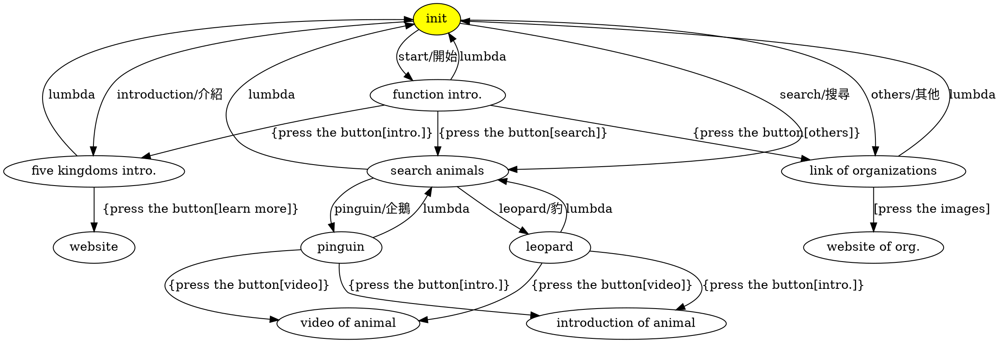

# 動物方程式
## 功能介紹
### 輸入"start/開始"指令
Linebot會跳出功能介紹

### 按下[intro.]按鈕
呈現生物五域的連鎖圖表

### 按下[search]按鈕
會詢問要問甚麼動物

接著輸入想查詢的動物名稱，例如：
* 豹

接著會跳出豹的品種供選擇，
現在按下[introduction]按鍵，將會出現：

按下[video]按鍵，將會跳出相關影片：

> 在搜尋方面我沒有做爬蟲功能，因此資料是寫死的。除了「豹」之外，還可以查詢「企鵝」

### 按下[others]按鈕
呈現各處組織的logo&連結

---

## FSM

